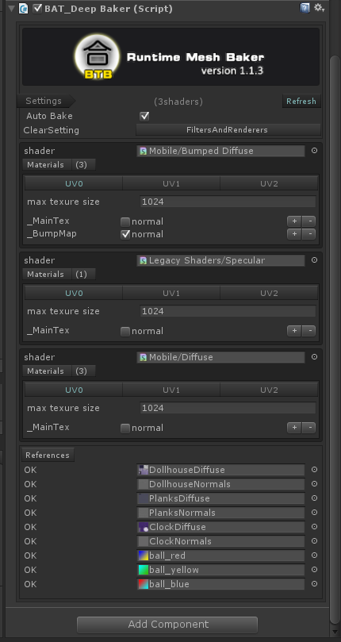

# Runtime Mesh Baker v1.1.3 #

|-------:|-------:|-------:|-------:|-------:|-------:|-------:|-------:|
| | |||||||

##Introduction:

Help you to combine meshes 、 materials and textures to reduce draw calls in runtime！
Got less draw calls than static and dynamic batching.
Got more resource saving than non-runtime baking.

- Support merging skinned-meshes of same material
- Very simple to use, learn in 1 minutes
- Works with any material and shader
- The most effective solution of combination
- Automaticly chek and configure the shaders
- Runtime combine quickly
- Runtime auto garbage recyling.
- Undo Supported, friendly UIs.

Warning:  this tool cannot combine meshes which vertext count are above 64k, because it is the limit of unity.

Home Page:[http://www.lonelywalker.cn](http://www.lonelywalker.cn) 
Support Mail: [mailoflonelywalker@qq.com](mailoflonelywalker@qq.com) 
My Blog:  [http://blog.csdn.net/andrewfan](http://blog.csdn.net/andrewfan) 

##Version Changes:

Version 1.1.3 2017.11.15

- new feature: upgrade the effective of MildBaker
- Fixed bug: error combination of mesh for skinned-meshes
- Fixed bug: error combination of sub-meshes for MildBaker
- Add Example: unitychan for SkinnedMeshBaker
- Add Example: unitytank for MildBaker

Version 1.1.2 2017.9.18

- Support merging skinned-meshes of same material

Version 1.1.1 2017.9.10

- support add baking script at runtime
- support the merging of multiple sub-meshes and multiple materials

##Download URL:

[Runtime Mesh Baker Of AssetStore](https://www.assetstore.unity3d.com/#!/content/90510)

##Usage:

1. Get your GameObjects ready for baking, just put them into one tree hierarchy, all GameObjects have the same top parent.

2. Select the top parent,then select the menu "Window/Rumtime Mesh Baker/Add MildBaker" or "Window/Rumtime Mesh Baker/Add DeepBaker"or "Window/Rumtime Mesh Baker/Add Skinned MeshBaker". 
At runtime,you can do it in you code:

	

		gameObject.AddComponent<BAT_DeepBaker>();//for static objects , eg stones,trees
		//or
		gameObject.AddComponent<BAT_MildBaker>();//for static objects , eg stones,trees
		//or
		gameObject.AddComponent<BAT_SkinnedMeshBaker>();//for motion objects , eg characters
	

3. It's ok. let's run it. Auto baking should be working.

##Mild Baking of meshes:

- Auto Bake: wheter do baking automatically
- ClearSetting: after baking, it would do some clearing operation.

##Deep Baking of meshes:

- Auto Bake: wheter do baking automatically 
- ClearSetting: after baking, it would do some clearing operation.
- Refresh button: refresh the configurations of baking.
- Shader: the group basis of meshes is the shader.
- Materials: materials use the same shader.
- UV configure- max texture size: max texture size could be when baking.
- UV configure- texture items: list all texture varient names of current shader to combine.you don't need to modify the items by default.
- References: list all the textures referenced. If any red item is shown,you can fix them by the "Fix troubles" button on the bottom.

##Mild Baking of skinned-meshes:

- Auto Bake: wheter do baking automatically
- ClearSetting: after baking, it would do some clearing operation.

It does the same work with Mild Baking,but for skinned-meshes.

##Baking Process:

1. Search the target gameobject, check all MeshFilters and MeshRenderers.
2. Find out all meshes and materials, and seperate the meshes into diffrent groups by materials(Mild Baking) or Shaders(Deep Baking) .
3. Deep baking need to combine textures and generate new material.Mild baking will just use the original material.
4. Create a new baking node and start mesh baking by groups,if group's mesh vertex count is overflow, then bake to new one mesh.
5. Set the MeshFilters by new created mesh,and set MeshRenderers by the material of current group.
6. Do clearing,it would remove the original MeshFilters and MeshRenderers by default.

 
##Diffrence of 3 baking method:

|:--:|:-------:|:------------------:|:-------------:|:-------------:|:-------------:|:-------------:|
|    |Basis   |Texture Combination|Mesh Combination|Draw calls    |Multiple SubMesh |Used for|
|Mild|material|not needed 	      |needed 	       |   less       |not support      |static objects|
|Deep|shader  |needed             |needed 	       |   least      |support          |static objects|
|Skinned|material  |not needed    |needed 	       |   less       |not support      |character objects|
##Troubleshooting

If Baking error eccours,check these items:

1. Make sure your Game Objects are not set static flags when deep baking.
2. The texutes should be readable and set the right format when deep baking.You can fix this by "Fix troubles" button.
3. If your material has set Tiling parameters(not 1), then the material can't not do deep baking.You could seperate these GameObject out of the baking tree.
4. If you are using the BAT_SkinnedMeshBaker， be aware with the transformation of original skinned-mesh componenet, the must be set to zero scalation、translation and rotation to its Animation or Animator,if don't, you may get bad ragdolls.
##Future Version

- to support skinned meshes
- to deal with tiling textures
- to support lightmapping